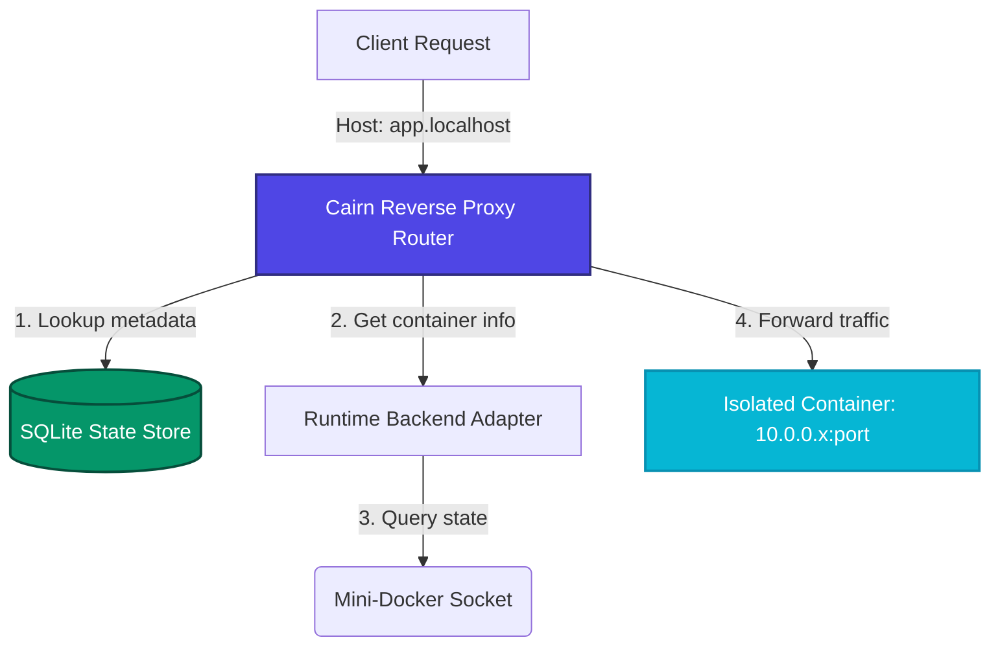
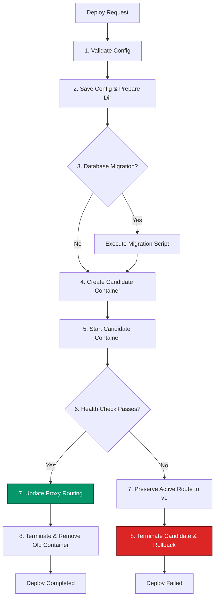

# 🏔️ Cairn

[](LICENSE)
[](https://golang.org)
[](https://python.org)

Cairn is a CLI-first, single-node Platform-as-a-Service (PaaS) built for orchestrating containerized backends, database engines, and scheduled tasks on Linux. Designed as a self-hosted alternative to modern cloud platforms, Cairn features zero-downtime rollouts, hardware-secured secrets, automated database persistence operations, and a resilient workflow execution engine.

Cairn sits cleanly above container runtimes (such as **Mini-Docker**) through an adapter abstraction layer, managing system states, routing topologies, and data lifecycles.

---

## 🏗️ Architecture & Request Flow

The following diagram illustrates how incoming client requests map to isolated container instances via Cairn's integrated virtual-host reverse proxy:



---

## 🔄 Deployment Lifecycle (DuraFlow Workflow)

Every service deployment or modification is executed as a multi-step workflow. If the candidate service fails health checks, Cairn automatically rolls back to the previous healthy deployment:



---

## 🛠️ Key Capabilities

* **Virtual-Host Reverse Proxy**: Built-in HTTP multiplexer mapping subdomains (e.g., `*.localhost`) to container bridge IPs. Automatically serves an operational custom fallback page if a service goes down.
* **Hardware-Secured Secrets**: Encrypts sensitive environment variables on the host filesystem using **AES-GCM** encryption keyed against local system keys. 
* **Stateful Database Drivers**: Native logical backup and restore flows for PostgreSQL, Redis, and MongoDB, replacing generic volume tarballs with true database snapshots.
* **Transactional Deployment Workflows**: Core state mutations run on the durable **DuraFlow** workflow engine, preventing corrupted configurations and orchestrating zero-downtime rollbacks.
* **Task Scheduling**: Integrated daemon-managed cron scheduler and headless background workers.
* **Web Monitoring Console**: Low-footprint web interface displaying real-time metrics, system events, service status, and deployment history logs.

---

## 🚀 Quickstart Installation

Ensure Go `v1.22+`, Python `v3.10+`, and `OverlayFS` are configured on your host system.

### 1. Run the Installer
Compile and configure Cairn using the automated script:
```bash
./scripts/install.sh
```
*This compiles the `cairn` CLI and `cairnd` daemon, initializes configurations in `~/.cairn/`, and moves binaries to `$HOME/.local/bin/`.*

### 2. Point at a Mini-Docker rootfs (no hardcoded paths)
```bash
export CAIRN_ROOTFS=/path/to/Mini-Docker/rootfs
export MINI_DOCKER_SOCKET="${XDG_RUNTIME_DIR:-/run/user/$(id -u)}/mini-docker/mini-docker.sock"
```

### 3. Start the Runtime Daemon (single instance)
```bash
sudo python3 -m mini_docker daemon \
  --socket "$MINI_DOCKER_SOCKET" \
  --socket-mode 666
```

### 4. Initialize, doctor, and launch Cairn
```bash
cairn init
cairn doctor
cairnd
```

### 5. Portable end-to-end demo
```bash
./scripts/clean_demo.sh
# or: make demo
```
See [docs/quickstart.md](docs/quickstart.md) and the failed-deploy postmortem under [docs/postmortems/](docs/postmortems/).

---

## 📖 Declarative Specification (`cairn.yaml`)

Services are defined using a structured configuration file:

```yaml
name: web-api
kind: web

runtime:
  backend: minidocker
  image_or_rootfs: "python:3.10-alpine"
  command: ["python", "app.py"]

environment:
  API_PORT: "8000"

volumes:
  - name: storage-volume
    mount: /app/data

healthcheck:
  type: http
  path: /healthz
  interval: 5s
  timeout: 2s
  retries: 3
  startup_grace: 10s

restart:
  policy: always
```

---

## 💻 CLI Reference

### Deployments & Process Control
```bash
# Deploy a service configuration
cairn deploy ./path/to/cairn.yaml

# View active workloads
cairn ps

# Control service state
cairn stop <service-name>
cairn restart <service-name>
```

### Secrets & Variables
```bash
# Set a configuration environment variable
cairn env set <service-name> KEY value

# Set a hardware-encrypted configuration secret
cairn secret set <service-name> API_KEY value

# List configuration keys (values for secrets are masked)
cairn env list <service-name>
```

### Volumes & Backups
```bash
# Create a volume snapshot
cairn backup create <volume-name>

# List backup snapshots
cairn backup list <volume-name>

# Revert a volume state to a specific snapshot
cairn restore <volume-name> <backup-id>
```

---

## 📄 License

Distributed under the MIT License. See [LICENSE](LICENSE) for more details.
