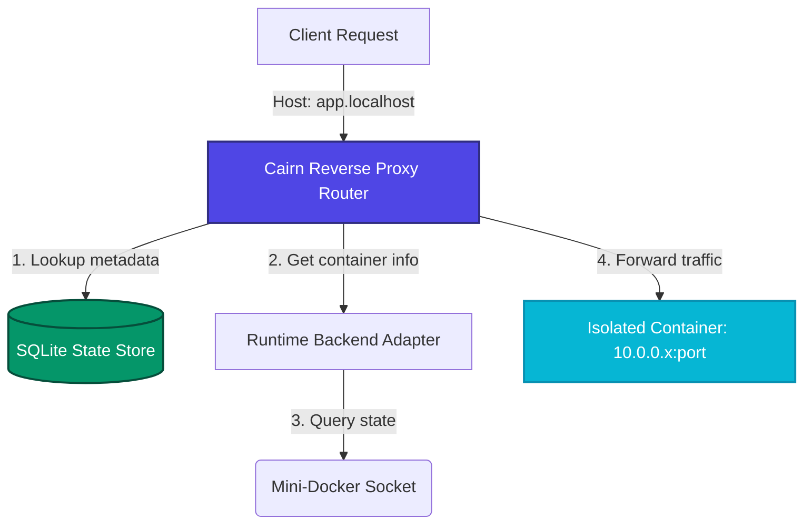
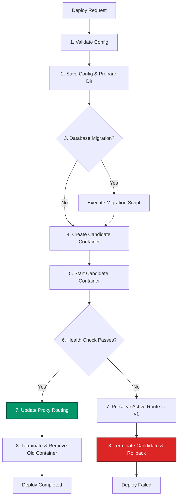

# 🏔️ Cairn

[](LICENSE)
[](https://golang.org)
[](https://python.org)

Cairn is a CLI-first, **single-node** Linux PaaS: deploy stateful services on **Mini-Docker**, durable deploys via **DuraFlow**, volumes/backups, reverse proxy, and a recoverability story when `cairnd` dies mid-deploy.

Not multi-node. Not a cloud clone. Spine = **Cairn + Mini-Docker + DuraFlow**. Lab projects (FailForge / MiniDB / Coordination) are portfolio-adjacent — see **[docs/STACK.md](docs/STACK.md)**.

---

## Reliability claim (single-node MLP)

**On one Linux host, Cairn deploys a stateful service on Mini-Docker, keeps a healthy release serving if a candidate fails or `cairnd` is killed mid-deploy, and you can re-run that proof locally.**

DuraFlow resumes unfinished work; failed candidates do not steal `current_deploy_id`; traffic stays on the last healthy release.

### Prove it (one command)

Sibling checkouts of **Cairn**, **DURAFLOW**, and **Mini-Docker** are required. Live proofs need **privileged Mini-Docker** (sudo/root for daemon + networking). Set env (or let `scripts/lib/runtime.sh` discover rootfs):

```bash
export CAIRN_ROOTFS="$(pwd)/../Mini-Docker/rootfs"
export PYTHONPATH="$(pwd)/../Mini-Docker${PYTHONPATH:+:$PYTHONPATH}"
export MINI_DOCKER_SOCKET="${XDG_RUNTIME_DIR:-/run/user/$(id -u)}/mini-docker/mini-docker.sock"

# Closeout A — single-node MLP proof (primary)
./scripts/prove_mlp.sh
# or: make prove
```

That runs units + clean deploy story + mid-deploy crash + rollback safety + failure matrix F1–F6 (including hard F5 backup interrupt).  
Other scripts: `clean_demo.sh`, `failure_matrix.sh`, `stability_gate.sh`, `cold_clone_verify.sh`, `prove_portability.sh`, `demo_reset.sh`.  
Unit/syntax only (no Mini-Docker): `N=1 SKIP_LIVE=1 ./scripts/stability_gate.sh` or `make smoke`.  
Same-machine Portability A proof (clean `/tmp` sibling tree, no Desktop): `./scripts/prove_portability.sh` — see [docs/PORTABILITY_A.md](docs/PORTABILITY_A.md).

### What GitHub Actions runs

**Unit tests + binary build + `bash -n` on `scripts/*.sh` only** (`.github/workflows/smoke.yml`).  
Full proofs need **local Linux + privileged Mini-Docker + DURAFLOW sibling**. FailForge continuous CI is **out of Closeout A** (optional lab only).

### Postmortems

| Topic | Doc |
| --- | --- |
| Failed deploy left wrong `current_deploy_id` | [docs/postmortems/2026-07-failed-deploy-metadata.md](docs/postmortems/2026-07-failed-deploy-metadata.md) |
| Mid-deploy `cairnd` kill + recovery | [docs/postmortems/2026-07-mid-deploy-crash-recovery.md](docs/postmortems/2026-07-mid-deploy-crash-recovery.md) |

Closeout criteria: [docs/CLOSEOUT_A.md](docs/CLOSEOUT_A.md) · Portability A (sibling layout, no Desktop hard req): [docs/PORTABILITY_A.md](docs/PORTABILITY_A.md) · [docs/roadmap.md](docs/roadmap.md).

---

## 🏗️ Architecture & Request Flow

The following diagram illustrates how incoming client requests map to isolated container instances via Cairn's integrated virtual-host reverse proxy:



---

## 🔄 Deployment Lifecycle (DuraFlow Workflow)

Every service deployment or modification is executed as a multi-step workflow. If the candidate service fails health checks, Cairn automatically rolls back to the previous healthy deployment:



---

## 🛠️ Key Capabilities

* **Virtual-Host Reverse Proxy**: Built-in HTTP multiplexer mapping subdomains (e.g., `*.localhost`) to container bridge IPs. Automatically serves an operational custom fallback page if a service goes down.
* **Hardware-Secured Secrets**: Encrypts sensitive environment variables on the host filesystem using **AES-GCM** encryption keyed against local system keys. 
* **Stateful Database Drivers**: Native logical backup and restore flows for PostgreSQL, Redis, and MongoDB, replacing generic volume tarballs with true database snapshots.
* **Transactional Deployment Workflows**: Core state mutations run on the durable **DuraFlow** workflow engine, preventing corrupted configurations and orchestrating zero-downtime rollbacks.
* **Task Scheduling**: Integrated daemon-managed cron scheduler and headless background workers.
* **Web Monitoring Console**: Low-footprint web interface displaying real-time metrics, system events, service status, and deployment history logs.

---

## 🚀 Quickstart Installation

**Sibling layout required** (DuraFlow is a local module replace, not a published version pin yet):

```text
parent/
  Cairn/          # this repo
  DURAFLOW/       # git clone git@github.com:Yumekaz/DURAFLOW.git
  Mini-Docker/    # git clone git@github.com:Yumekaz/Mini-Docker.git
```

Go `1.26.x` (see `go.mod`), Python `3.10+`, OverlayFS. Mini-Docker daemon needs root (or carefully configured rootless).

### 1. Clone siblings + install
```bash
mkdir -p ~/src && cd ~/src
git clone git@github.com:Yumekaz/Cairn.git
git clone git@github.com:Yumekaz/DURAFLOW.git
git clone git@github.com:Yumekaz/Mini-Docker.git
cd Cairn
./scripts/install.sh
```

### 2. Runtime env
```bash
export CAIRN_ROOTFS="$(pwd)/../Mini-Docker/rootfs"
export MINI_DOCKER_SOCKET="${XDG_RUNTIME_DIR:-/run/user/$(id -u)}/mini-docker/mini-docker.sock"
export PYTHONPATH="$(pwd)/../Mini-Docker${PYTHONPATH:+:$PYTHONPATH}"
```

### 3. Start Mini-Docker (single daemon)
```bash
sudo mkdir -p "$(dirname "$MINI_DOCKER_SOCKET")"
sudo env PYTHONPATH="$PYTHONPATH" python3 -m mini_docker daemon \
  --socket "$MINI_DOCKER_SOCKET" \
  --socket-mode 666
```

### 4. Init + doctor + demo
```bash
cairn init
cairn doctor
./scripts/clean_demo.sh
```

### Private cold-clone / portability self-check (no friends required)
From a Cairn checkout you already trust:
```bash
./scripts/prove_portability.sh   # Portability A: clean tree under /tmp, no Desktop
./scripts/cold_clone_verify.sh   # optional: fresh git clones + clean_demo
```

See [docs/PORTABILITY_A.md](docs/PORTABILITY_A.md), [docs/quickstart.md](docs/quickstart.md), and [docs/postmortems/](docs/postmortems/).

---

## 📖 Declarative Specification (`cairn.yaml`)

Services are defined using a structured configuration file:

```yaml
name: web-api
kind: web

runtime:
  backend: minidocker
  image_or_rootfs: "python:3.10-alpine"
  command: ["python", "app.py"]

environment:
  API_PORT: "8000"

volumes:
  - name: storage-volume
    mount: /app/data

healthcheck:
  type: http
  path: /healthz
  interval: 5s
  timeout: 2s
  retries: 3
  startup_grace: 10s

restart:
  policy: always
```

---

## 💻 CLI Reference

### Deployments & Process Control
```bash
# Deploy a service configuration
cairn deploy ./path/to/cairn.yaml

# View active workloads
cairn ps

# Control service state
cairn stop <service-name>
cairn restart <service-name>
```

### Secrets & Variables
```bash
# Set a configuration environment variable
cairn env set <service-name> KEY value

# Set a hardware-encrypted configuration secret
cairn secret set <service-name> API_KEY value

# List configuration keys (values for secrets are masked)
cairn env list <service-name>
```

### Volumes & Backups
```bash
# Create a volume snapshot
cairn backup create <volume-name>

# List backup snapshots
cairn backup list <volume-name>

# Revert a volume state to a specific snapshot
cairn restore <volume-name> <backup-id>
```

---

## 📄 License

Distributed under the MIT License. See [LICENSE](LICENSE) for more details.
