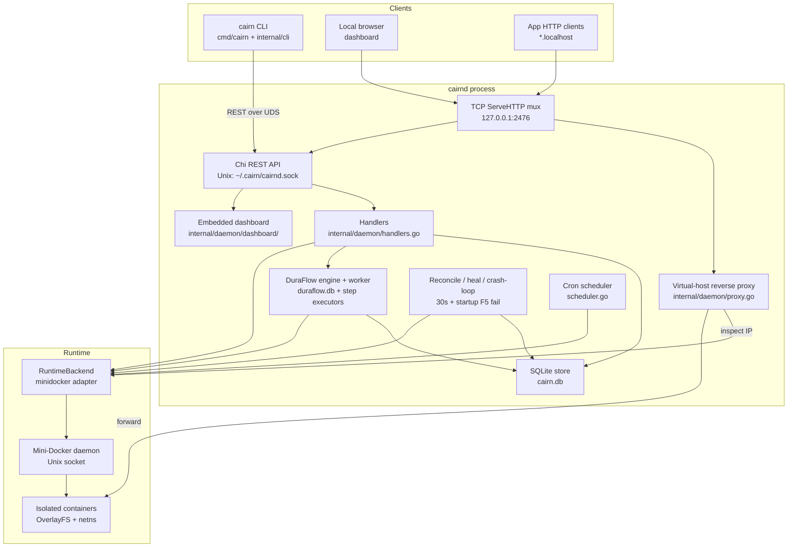

# Cairn Single-Node PaaS — Design Document

| Field | Value |
| --- | --- |
| **Document** | `docs/design/CAIRN_SINGLE_NODE.md` |
| **Author** | Cairn maintainers / portfolio packaging |
| **Date** | 2026-07-28 |
| **Status** | **Ready for portfolio packaging** |
| **Scope** | Closeout A: single-node MLP spine (Cairn + Mini-Docker + DuraFlow) |
| **Repo** | `/home/yumekaz/Desktop/SERVER` (Cairn) |

---

## Overview

Cairn is a **CLI-first, single-node Linux PaaS** for stateful backend services. It deploys containers through a clean **runtime adapter** onto **Mini-Docker**, orchestrates durable multi-step deploys/backups/restores with **DuraFlow**, persists control-plane state in **SQLite**, and exposes a local admin dashboard over loopback HTTP plus a virtual-host reverse proxy for `*.localhost` traffic.

This document is a **retrospective architecture** of what was built for Closeout A (the Minimum Lovable Product), not a greenfield product plan. It records the problem, goals/non-goals, key decisions and tradeoffs, the proof story, and a **rebaselined** dashboard PR plan that marks already-shipped polish as Done.

**Reliability claim (from README):** on one Linux host, Cairn deploys a stateful service on Mini-Docker, keeps a healthy release serving if a candidate fails or `cairnd` is killed mid-deploy, and that proof can be re-run locally via `./scripts/prove_mlp.sh`.

---

## Background & Motivation

### Problem

Homelab and single-server operators need something smaller than Kubernetes/Nomad that still treats **state** seriously: volumes survive redeploy, backups/restores are first-class, a broken release must not steal traffic or metadata identity, and killing the control plane mid-deploy must not leave a permanent lie in SQLite.

Existing “self-host PaaS” tools often optimize for multi-service UX and dashboards first; Cairn’s MLP deliberately optimizes for **stateful correctness proofs** first (CLI + scripts), with a dashboard as a local operator console rather than the product identity.

### Current state (as of this document)

| Layer | Reality in tree |
| --- | --- |
| Control plane | `cmd/cairnd` + `internal/daemon/` (Chi over Unix socket + optional TCP `127.0.0.1:2476`) |
| CLI | `cmd/cairn` + `internal/cli/` → REST over `~/.cairn/cairnd.sock` |
| Metadata | SQLite `~/.cairn/cairn.db` (`internal/store/`), WAL, single writer |
| Workflows | DuraFlow sibling (`replace => ../DURAFLOW`) + Cairn step executors in `internal/daemon/duraflow_workflows.go` |
| Runtime | `internal/runtime.RuntimeBackend` → Mini-Docker adapter (`internal/runtime/minidocker/`) |
| Proof | `./scripts/prove_mlp.sh` (units + clean_demo + mid-deploy crash + rollback safety + F1–F6) |
| Dashboard | Vanilla JS console at `internal/daemon/dashboard/` with truthful connection UX |

### Pain points already closed (postmortems)

1. **Failed deploy stole `current_deploy_id`** — runtime stayed on healthy container; SQLite pointed at failed candidate. Fixed with pure rules in `internal/deploymeta/` and success-only promotion. See `docs/postmortems/2026-07-failed-deploy-metadata.md`.
2. **Mid-deploy `cairnd` kill marked deploy failed / reconcile raced** — `failDeployUnlessInterrupted`, active-deploy-aware reconcile, DuraFlow lease reclaim. See `docs/postmortems/2026-07-mid-deploy-crash-recovery.md`.
3. **Interrupted backup could look successful** — `failIncompleteBackupsOnStartup()` fails non-terminal backup rows on restart (hard F5).

---

## Goals & Non-Goals

### Goals (Closeout A / MLP)

1. Deploy one (or few) **stateful** services on a single Linux host via Mini-Docker.
2. Persist volumes across restart/redeploy; backup and restore with checksums.
3. Health-gated deploy: failed candidate does **not** replace healthy release (runtime **and** metadata).
4. Durable workflows: incomplete DuraFlow runs resume after `cairnd` restart.
5. Honest event timeline for deploy/health/route/backup/restore/lifecycle.
6. Crash-loop bounding on reconcile auto-heal (default 5 restarts / 10 minutes).
7. Rollback safety when intervening successful deploys set `state_touched` (migration-scoped).
8. One local prove command: `./scripts/prove_mlp.sh` / `make prove`.
9. Local dashboard as **ops console**, not dashboard-first product.

### Non-goals (explicitly deferred / skipped)

| Item | Why deferred |
| --- | --- |
| **Multi-node / Phase 18** | Placement, remote hosts, coordinator, replicated metadata — orchestration bloat before single-node maturity |
| **Built-in TLS / ACME** | Plain HTTP proxy; terminate TLS with Caddy/Nginx/CF Tunnel on host (`docs/limitations.md`) |
| **Docker Hub / multi-runtime product** | Mini-Docker is the primary backend; rootfs/image story is local stack, not a registry product |
| **MiniDB as platform store** | Lab KV (Mini-Redis-Cassandra); Cairn store stays SQLite |
| **FailForge as continuous CI** | Harness under `tests/failure/` is optional lab; GHA is unit + build + `bash -n` only |
| **Dashboard redesign / SPA framework** | STACK defers “dashboard redesign”; vanilla embed is intentional footprint |
| **Replica scaling / distributed volumes** | Single replica; volume write conflicts if scaled |

---

## Spine vs Lab

Honest map from `docs/STACK.md`:

| Layer | Projects | Role for Closeout A |
| --- | --- | --- |
| **Spine** (required) | **Cairn → Mini-Docker → DuraFlow** | Deploy, recoverability, backups, events |
| **Lab** (portfolio-adjacent) | FailForge, MiniDB, Coordination-service | Chaos / educational targets; **not** required to close A |

```text
                    Clients / CLI
                          │
                          ▼
                   ┌─────────────┐
                   │    Cairn    │  this repo
                   │  control    │
                   │   plane     │
                   └──────┬──────┘
            runtime       │ workflows
            adapter       │
               │          │
               ▼          ▼
        ┌────────────┐  ┌──────────┐
        │ Mini-Docker│  │ DuraFlow │
        │  containers│  │ durable  │
        └────────────┘  │  steps   │
                        └──────────┘
              ▲ spine (MLP closeout)

        ── lab below (not required for A) ──

        FailForge (local chaos)
              │                    │
              ▼                    ▼
     Mini-Redis-Cassandra    Coordination-service
```

Sibling layout expected by `go.mod` replace and prove scripts:

```text
parent/
  Cairn/          # or SERVER checkout
  DURAFLOW/
  Mini-Docker/
```

---

## Architecture (Part A)

### High-level component map



### Request paths

1. **Control plane (CLI):** `cairn` → HTTP client dials Unix socket → Chi routes in `setupRoutes()` (`handlers.go`) → store / DuraFlow / runtime.
2. **Dashboard / API TCP:** same Chi router + dashboard static handler; `Server.ServeHTTP` intercepts `*.localhost` before API.
3. **App traffic:** Host `svc.localhost` → load service row → inspect container IP → `httputil.ReverseProxy` to bridge IP:container port; unavailable → 503 custom page.

### Deploy lifecycle (DuraFlow template `deploy`)

Registered in `RegisterDuraFlowTemplates` (`internal/daemon/duraflow_workflows.go`):

```text
validate_config
  → save_config_on_disk
  → pre_deploy_backup
  → run_migration          # sets state_touched on success
  → create_container       # candidate cairn-<svc>-<deploy8>
  → start_container
  → run_health_check
  → route_traffic_and_cleanup   # ONLY then AfterSuccess(current_deploy_id)
```

```mermaid
sequenceDiagram
  participant CLI as cairn CLI
  participant H as handlers
  participant DF as DuraFlow worker
  participant S as SQLite
  participant R as Mini-Docker
  participant P as Proxy

  CLI->>H: POST /services (cairn.yaml)
  H->>S: insert deploy pending; PrepareCandidate
  H->>DF: start deploy workflow
  DF->>R: create/start candidate
  DF->>DF: health checks
  alt health OK
    DF->>S: AfterSuccess(candidateID)
    DF->>S: RouteUpdated event
    DF->>R: stop/remove old container
  else health fail
    DF->>S: AfterFailure(previous); RoutePreserved
    DF->>R: remove candidate
  end
  Note over P,S: Proxy always uses current RuntimeID / healthy current_deploy_id
```

Backup template: single step `run_backup` (tar.gz + SHA256 via `backup_engine.go`).  
Restore template: `stop_container` → `verify_and_extract` → `start_container`.

### Control-plane background loops (`server.go`)

| Loop | Interval / trigger | Responsibility |
| --- | --- | --- |
| Cron scheduler | continuous | Spawn scheduled job containers |
| `failIncompleteBackupsOnStartup` | once at Start | Hard-fail pending/interrupted backups |
| DuraFlow worker | continuous | Resume incomplete runs / reclaim leases |
| `startReconciliationLoop` | 30s | Restart/recreate desired=running; crash-loop bound; dangling `cairn-*` cleanup (skipped while any deploy active) |
| `startDeployHealLoop` | periodic | Heal deploy projections after crash-resume |
| Metadata backup | 1h + start | Copy `cairn.db` under `backups/metadata/`, keep 5 |

### Key packages (cite paths)

| Package / path | Role |
| --- | --- |
| `cmd/cairn`, `cmd/cairnd` | Binary entrypoints |
| `internal/cli/` | Cobra commands (deploy, ps, backup, restore, events, doctor, dashboard, …) |
| `internal/daemon/server.go` | Server lifecycle, reconcile, heal, F5 startup, DuraFlow wiring |
| `internal/daemon/handlers.go` | REST surface (`/status`, `/services`, `/volumes`, `/events`, `/cron`, dashboard) |
| `internal/daemon/duraflow_workflows.go` | Deploy/backup/restore step executors |
| `internal/daemon/proxy.go` | `*.localhost` reverse proxy multiplexer |
| `internal/daemon/backup_engine.go` | Tar.gz + SHA256 archives |
| `internal/daemon/crashloop.go` | Process-local restart window (5/10m) |
| `internal/daemon/dashboard/` | Embeddable local admin UI (`index.html/js/css`, `dashboard.go`) |
| `internal/deploymeta/meta.go` | Pure `PrepareCandidate` / `AfterSuccess` / `AfterFailure` |
| `internal/duraflow/engine.go` | Cairn↔DuraFlow executor bridge |
| `internal/runtime/runtime.go` | `RuntimeBackend` interface |
| `internal/runtime/minidocker/` | Socket HTTP client + adapter |
| `internal/store/` | SQLite schema + CRUD (services, deploys, volumes, backups, events, envs, workflows, …) |
| `internal/config/` | Daemon config defaults, AES-GCM secrets host key |
| `internal/events/` | Event type constants |
| `scripts/prove_mlp.sh` | Closeout A one-command proof |
| `scripts/lib/runtime.sh` | Mini-Docker / cairnd discovery (non-hanging sudo) |
| `docs/STACK.md`, `docs/CLOSEOUT_A.md`, `docs/roadmap.md` | Spine/lab, DoD, phase status |

### Data model (SQLite)

Schema created in `internal/store/migrations.go`:

- **services** — id, name, kind, runtime_backend, runtime_id, **current_deploy_id**, desired/actual state, route
- **deploys** — version, status, stage, health_status, **previous_deploy_id**, **state_touched**, failure_reason
- **volumes** / **backups** — host paths, status, size_bytes, **checksum**
- **events** — type, message, optional FKs, metadata_json
- **cron_jobs** / **jobs** — schedule + run history
- **duraflow_workflows** / **duraflow_steps** — Cairn-side workflow projection (DuraFlow also owns `duraflow.db`)
- **service_envs** — env vars; secrets flagged `is_secret` (values encrypted at rest via host key)

WAL mode, `busy_timeout=30000`, `MaxOpenConns(1)` — single-writer design for a single-node control plane.

### REST surface (summary)

From `setupRoutes()`:

```
GET  /status
GET|POST /services  … /services/{name}[/(start|stop|restart|logs|rollback|run|deploys|env)]
GET|POST /volumes   … /volumes/{name}[/(backups|restore)]
GET  /events
/cron …
GET  /dashboard/*   → embedded static UI
GET  /              → redirect /dashboard/
```

CLI talks over Unix socket; dashboard uses same handlers over TCP when `DashboardAddr` is set (default `127.0.0.1:2476` in `internal/config/config.go`).

### Runtime adapter contract

```go
// internal/runtime/runtime.go
type RuntimeBackend interface {
    CreateContainer(ctx context.Context, cfg *api.ServiceConfig, name string) (string, error)
    StartContainer(ctx context.Context, id string) error
    StopContainer(ctx context.Context, id string) error
    RestartContainer(ctx context.Context, id string) error
    RemoveContainer(ctx context.Context, id string) error
    InspectContainer(ctx context.Context, id string) (*ContainerInfo, error)
    StreamLogs(ctx context.Context, id string, follow bool, tail int) (io.ReadCloser, error)
    ListContainers(ctx context.Context) ([]*ContainerInfo, error)
}
```

Default implementation: `minidocker.NewAdapter(socket, volumeDir)` wired in `cmd/cairnd/main.go`. Volumes bind as `VolumeDir/<name>:<mount>:rw`. Workers/cron use `networkMode=none`.

### Deploy metadata rules (critical)

```go
// internal/deploymeta/meta.go — pure, unit-tested without Mini-Docker
PrepareCandidate(prev, candidate) → (previousDeployID=prev, currentDuringAttempt=prev)
AfterSuccess(candidate)           → candidate becomes current
AfterFailure(prev)                → restore prev (empty if first deploy never succeeded)
```

Invariant: **candidates never become `current_deploy_id` until health success.** Env-triggered redeploys and rollback share these rules.

---

## Key Decisions

| # | Decision | Choice | Rationale | Tradeoff |
| --- | --- | --- | --- | --- |
| K1 | Topology | **Single-node only** for MLP | Matches target machine (2–4c / 4–8GB); multi-node deferred to Phase 18 | No HA control plane; host is SPOF by design |
| K2 | Runtime isolation | **Mini-Docker** via adapter, not Docker SDK in core | Homegrown stack; portable interface for later adapters | Requires privileged Linux + sibling rootfs; no macOS native |
| K3 | Durability engine | **DuraFlow** (sibling module replace) for deploy/backup/restore | Checkpointed steps + lease reclaim after kill | Extra sibling checkout; not a published version pin |
| K4 | Control metadata | **SQLite WAL** (`modernc.org/sqlite`, pure Go) | Single file, embeddable, no external DB ops | Not for thousands of concurrent writers; not multi-node |
| K5 | Deploy identity | **Success-only `current_deploy_id`** (`deploymeta`) | Runtime safety without metadata safety was a real bug | More paths must share Prepare/AfterSuccess/AfterFailure |
| K6 | Interrupt semantics | **Do not fail deploy on `context.Canceled`** | Mid-deploy SIGTERM/SIGKILL must resume, not poison history | Pending deploys need heal/reconcile awareness |
| K7 | Reconcile vs deploy | **Skip whole reconcile while any deploy active** | Prevents deleting still-serving previous release mid-recovery | Longer window if a deploy is stuck (mitigated by heal + crash proofs) |
| K8 | Backup interrupt | **Fail incomplete backups on startup** (hard F5) | Never surface success→missing/corrupt archive | Operator must re-run backup after crash |
| K9 | Rollback safety | **Migration-scoped `state_touched`**, not all volume writes | Avoid blocking rollback on ordinary app writes | Policy is narrower than “any disk mutation” |
| K10 | Crash-loop | **Process-local tracker 5/10m** then desired=stopped | Stop thrash without distributed coordination | Counter resets on daemon restart |
| K11 | Proxy | **Host-based `*.localhost` reverse proxy**, plain HTTP | Zero-config local demos | No TLS; external terminator required for real certs |
| K12 | CLI transport | **Unix domain socket** for CLI; TCP only for dashboard/API loopback | Local-first security boundary | Remote CLI needs SSH/tunnel (out of scope) |
| K13 | Secrets | **AES-GCM with host key under data dir** | Better than plaintext env on disk | Host compromise still yields keys; not HSM |
| K14 | CI honesty | **GHA = unit + build + bash -n**; full prove local | Privileged Mini-Docker not available on runners | “Green CI” ≠ full reliability claim |
| K15 | Dashboard stack | **Vanilla embed (HTML/CSS/JS)** | Zero build step, low footprint, matches single-node ops | No component framework; careful manual a11y |
| K16 | Lab separation | **FailForge/MiniDB/Coordination out of A** | Keep MLP prove focused on spine | Portfolio demos live elsewhere; not gates |

---

## Alternatives Considered

### A1. Docker / compose as the primary runtime

- **Pros:** Ecosystem, Hub images, host tooling familiarity.
- **Cons:** Sidesteps the spine story (Mini-Docker learning system); pulls in dockerd privilege and version matrix.
- **Verdict:** Deferred. Adapter interface leaves room for a future Docker backend without rewriting deploy rules.

### A2. Kubernetes / k3s / Nomad for orchestration

- **Pros:** Multi-node, mature controllers.
- **Cons:** Violates single-node footprint and MLP identity; operator complexity dwarfs the reliability lessons we wanted to prove.
- **Verdict:** Explicit non-goal.

### A3. In-process workflow state only (no DuraFlow)

- **Pros:** Fewer dependencies.
- **Cons:** Mid-deploy daemon death requires hand-rolled leases, step journals, and reclaim — we already hit those bugs.
- **Verdict:** DuraFlow sibling is the right durability boundary; Cairn owns product steps.

### A4. Postgres/MiniDB for control store

- **Pros:** Concurrent writers, “real DB” résumé signal.
- **Cons:** Operational weight for a single-node control plane; MiniDB is lab RF-KV, not a production control store.
- **Verdict:** SQLite stays; MiniDB remains lab-only (`docs/STACK.md`).

### A5. Dashboard-first React SPA

- **Pros:** Polished multi-page UX, component libraries.
- **Cons:** Build pipeline, larger binary/assets, MLP hard rule was CLI-first proof before dashboard polish.
- **Verdict:** Vanilla console with targeted reliability UX (connection truth, disable mutations offline). Residual polish is small, not a rewrite.

### A6. FailForge matrix on GitHub Actions

- **Pros:** Continuous chaos signal.
- **Cons:** Needs privileged Mini-Docker + siblings; flaky/expensive on public runners.
- **Verdict:** Local prove + optional lab harness; **OUT of Closeout A**.

---

## Proof & Verification Story

### Primary command

```bash
./scripts/prove_mlp.sh
# or: make prove
```

What it runs (`scripts/prove_mlp.sh`):

1. `stability_gate.sh` with `SKIP_LIVE=1` — units + `bash -n`
2. Ensure Mini-Docker + cairnd (`scripts/lib/runtime.sh`)
3. `clean_demo.sh` — full deploy/backup/broken-deploy/restore/events story
4. `mid_deploy_crash_demo.sh` (SIGTERM)
5. `rollback_safety_demo.sh`
6. `failure_matrix.sh` F1–F6 (optional `PROVE_QUICK=1` skips F2 SIGKILL)

### Failure matrix (Phase 17)

| ID | Failure | Script / CASE |
| --- | --- | --- |
| F1 | SIGTERM mid-migration | `mid_deploy_crash_demo` / F1 |
| F2 | SIGKILL mid-migration | `KILL_SIGNAL=SIGKILL` / F2 |
| F3 | Mini-Docker daemon death | F3 |
| F4 | App container dies after healthy | F4 (+ `ServiceRestarted`) |
| F5 | Backup interrupted (**hard**) | F5 — incomplete failed on restart |
| F6 | Broken deploy after healthy | `clean_demo` / F6 |

### CI vs local

| Gate | Command | Needs Mini-Docker |
| --- | --- | --- |
| GHA smoke | unit + build + `bash -n` (`.github/workflows/smoke.yml`) | No |
| Local unit shape | `N=1 SKIP_LIVE=1 ./scripts/stability_gate.sh` | No |
| Closeout A | `./scripts/prove_mlp.sh` | **Yes, privileged** |

---

## Part B — Dashboard rebaseline

### Intent

The dashboard at `internal/daemon/dashboard/` is **not** a greenfield “beast polish” project. Most operator UX already shipped. Part B **rebaselines** status: mark Done work as **SHIPPED**; remaining PRs only for residual gaps.

### SHIPPED (do not re-plan as future PRs)

| Capability | Where / notes |
| --- | --- |
| Truthful connection state (connecting / online / offline) | `setConnectionState`, boot starts **connecting**, green only after `/status` OK |
| Exponential backoff + jitter on disconnect | `nextStatusDelay`, `STATUS_BASE_MS=5s`, max 30s |
| Offline banner + `body.daemon-offline` | Global banner, `is-offline` on status wrap |
| `.needs-online` disable while offline | Mutation buttons disabled; re-enabled when online (unless `data-busy`) |
| `escapeHtml` on untrusted strings | Helpers; no raw alert() for ops feedback |
| Toasts | `showToast` + `#toast-host` `aria-live=polite` |
| Skeletons + empty states | Overview/services/volumes/events loaders |
| Panel polling (active route only) | `PANEL_REFRESH_MS=8s`, staggered with status |
| Services/volumes **colgroup** stable columns | `index.html` colgroups — thrash fix |
| Events type filter | `#events-type-filter` |
| Log follow checkbox | `#chk-logs-follow` + near-bottom stickiness |
| `prefers-reduced-motion` | `index.css` media query |
| a11y: `aria-live`, dialog roles | Connection status, toasts, modals |
| **`document.visibilitychange` pause/resume polls** | Clears timers when hidden; on visible: immediate `/status` + panel refresh + reschedule |
| **Focus trap + restore on modals** | `activateModalTrap` / `deactivateModalTrap`, Tab cycle, Escape, return focus |
| **`aria-current="page"` on nav** | `setActiveNav()` |

Connection spine (already in `index.js`):

```javascript
// Boot: connecting, not green
// pollDaemonStatus → /status success → setConnectionState(true)
// failure → reconnectAttempts++, backoff schedule
// visibilitychange: if hidden clear timers; if visible poll + refresh + schedule
```

### Remaining work (realistic PR plan only)

| PR | Priority | Scope | Notes |
| --- | --- | --- | --- |
| **PR-D1** (optional) | Low | Skip full `innerHTML` rebuild when payload unchanged | Hash or `JSON.stringify` compare of services/events/volumes list payloads before rewriting DOM; reduces flicker under 8s poll |
| **PR-D2** (optional) | Low | Overview backups N+1 mitigation | Today `loadOverviewData` does `Promise.all(volumes.map → GET /volumes/{name}/backups))`. Prefer `GET /status` field, aggregate `GET /backups/count`, or sample/cap concurrency. Fine for homelab volume counts; not a spine bug |
| **PR-D3** (optional) | Docs | Copy/packaging of design docs | This document under `docs/design/CAIRN_SINGLE_NODE.md`; link from README/STACK if desired |

**No further “connection reliability” or “modal a11y foundation” PRs are required for Closeout A.** Those items are SHIPPED.

---

## Security & Privacy Considerations

| Topic | Position |
| --- | --- |
| AuthN/Z | Local Unix socket + loopback dashboard; **no multi-user auth** in MLP |
| Network exposure | Default dashboard bind `127.0.0.1:2476`; do not expose without reverse proxy + auth |
| Secrets | AES-GCM env secrets; host key under data dir; never commit `SUDO_PASSWORD` |
| Proxy | Plain HTTP; TLS is operator-side |
| Multi-tenant | Not supported; single trust domain on the host |
| Threat | Compromised host ⇒ full control plane + volumes; acceptable for single-node homelab |

---

## Observability

- **Events table** + `cairn events` / dashboard Events panel — primary audit story (`docs/events.md`)
- **Daemon log** — `~/.cairn/cairnd.log` via `internal/logging`
- **Deploy stages** — deploy rows status/stage/failure_reason; DuraFlow run/step state
- **Doctor** — `cairn doctor` preflight (Mini-Docker reachability)
- **Metrics/Prometheus** — not in MLP; deferred
- **Crash-loop / reconcile** — log lines + `ServiceRestarted` / `ServiceStopped` events

---

## Rollout / Closeout Plan

Closeout A is **code Done**; live proofs need privileged Mini-Docker (documented as **needs live verify** until a host run is green; `docs/CLOSEOUT_A.md` notes a successful ALL GREEN prove on a privileged machine).

| Stage | Action |
| --- | --- |
| Dev | `make smoke` / `SKIP_LIVE=1` gate |
| Local prove | `./scripts/prove_mlp.sh` after material control-plane changes |
| Portability | `./scripts/prove_portability.sh` (clean `/tmp` sibling tree) |
| Dashboard residuals | Optional PR-D1/D2 only; no redesign |
| Multi-node / TLS / Hub | Explicitly **not** rolled out under A |

Rollback strategy for product changes: re-run prove; SQLite metadata backups under `backups/metadata/`; volume backups via DuraFlow.

---

## Risks

| Risk | Severity | Mitigation |
| --- | --- | --- |
| Live prove skipped → false confidence | High | README + roadmap label **needs live verify**; CI honesty |
| Dangling containers after hard kill during create | Medium | Reconcile dangling `cairn-*` cleanup; deterministic names |
| Crash-loop counter lost on daemon restart | Low | Accept process-local; events remain in SQLite |
| Overview N+1 backups | Low | Optional PR-D2; volume counts stay small |
| Dashboard polls while laptop lid open but idle | Low | **visibilitychange** already pauses |
| Sibling DURAFLOW/Mini-Docker drift | Medium | `bootstrap_stack.sh`, `cold_clone_verify.sh`, `prove_portability.sh` |
| Operator exposes `:2476` publicly | High | Docs: loopback only; no auth in MLP |

---

## Open Questions

1. Should overview backup counts move into `/status` (one round-trip) or stay client-side N+1 until volume counts grow?
2. Is payload-hash DOM skip (PR-D1) worth the complexity vs silent poll with stable colgroups already in place?
3. When (if ever) to un-defer Phase 18 multi-node relative to continuous green prove_mlp without babysitting?
4. Separate `CrashLoopDetected` event type vs current `ServiceStopped` message convention?

---

## PR Plan (summary table)

| ID | Status | Description |
| --- | --- | --- |
| Closeout A spine (prove, F1–F6, events, rollback, F5 hard) | **SHIPPED** | Code/scripts in tree; re-run live prove after changes |
| Dashboard connection truth + backoff + offline UX | **SHIPPED** | `index.js` connection module |
| Dashboard skeletons, toasts, escapeHtml, empty states | **SHIPPED** | |
| Panel poll, colgroup thrash fix, events filter, log follow | **SHIPPED** | |
| prefers-reduced-motion, aria-live dialogs | **SHIPPED** | |
| visibilitychange pause/resume | **SHIPPED** | Residual #1 closed in tree |
| Modal focus trap + focus restore; aria-current nav | **SHIPPED** | Residual #2 closed in tree |
| PR-D1 skip unchanged innerHTML rebuild | **Optional residual** | Hash/stringify compare |
| PR-D2 overview backups aggregation | **Optional residual** | N+1 mitigation if desired |
| PR-D3 design doc packaging | **This doc** | `docs/design/CAIRN_SINGLE_NODE.md` |
| Multi-node / TLS / Docker Hub / MiniDB store / FailForge CI | **Out of scope (skipped)** | Not future A PRs |

---

## References

| Doc / path | Why |
| --- | --- |
| `README.md` | Reliability claim, mermaid deploy/proxy overview |
| `docs/STACK.md` | Spine vs lab |
| `docs/CLOSEOUT_A.md` | Definition of done |
| `docs/roadmap.md` | Phases 17–19, prove commands |
| `docs/architecture.md` | Component overview |
| `docs/limitations.md` | Honest boundaries |
| `docs/events.md` | Event taxonomy |
| `docs/runtime-adapter.md` | `RuntimeBackend` contract |
| `docs/specs/MINIMUM_LOVABLE_PRODUCT.md` | Original MLP brief |
| `docs/postmortems/2026-07-failed-deploy-metadata.md` | current_deploy_id bug |
| `docs/postmortems/2026-07-mid-deploy-crash-recovery.md` | Mid-deploy kill |
| `scripts/prove_mlp.sh` | One-command A proof |
| `internal/deploymeta/meta.go` | Deploy identity rules |
| `internal/daemon/dashboard/index.js` | Dashboard connection + a11y spine |
| `go.mod` | Go 1.26.x; `replace` DURAFLOW sibling |

---

## Document control

| Version | Date | Notes |
| --- | --- | --- |
| 1.0 | 2026-07-28 | Retrospective Closeout A design; dashboard rebaseline (residuals 1–2 marked SHIPPED) |

**Status: Ready for portfolio packaging**
